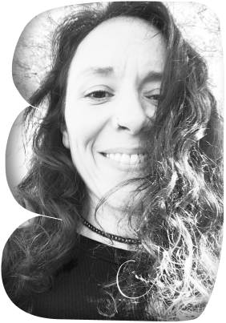

👋🏽 Hello! I am Viviana.

I am a creative web developer with a background in audiovisual communication.

I care about crafting enjoyable experiences that make the web more accessible and inclusive.

👩🏽‍💻 I wrote my first lines of code while working as a 2D character animator and loved it. Eventually, I decided to fully transition my career into software development.

⚽️ I am a collaborative team player who can quickly adapt to new environments and tasks. 
During the last months, I completed a software engineering internship at the Wikimedia Foundation and participated as a frontend developer at The Collab Lab. See <a href="https://github.com/wikimedia/mediawiki-extensions-GrowthExperiments/commits?author=vivitt" target='_blank'>my contributions</a> or <a href="/cv/Viviana_Yanez-frontend_developer.pdf" target="_blank" >download my CV</a>.

👀 My interests include creativity, culture, technical writing, knowledge sharing, and everything in between.

🎨 I love the intersection between design and engineering, and my work always takes a user-centric approach. I care about crafting enjoyable experiences that make the web more accessible and inclusive.

💌 Thanks for your visit!  Please feel free to reach out on <a href="https://www.linkedin.com/in/viviana-yanez/" target='_blank'>Linkedin</a>, I am always happy to exchange experiences, learnings, and thoughts.

