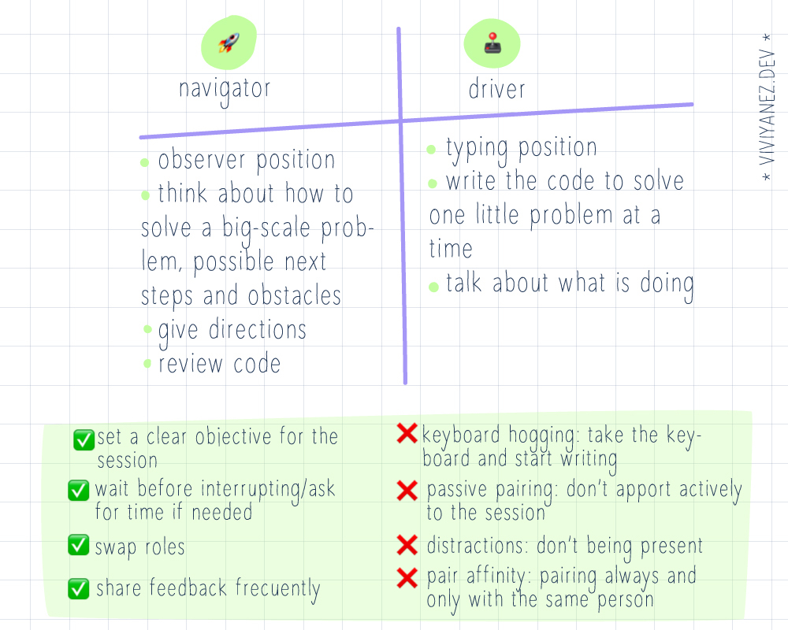

# Some insights and takeaways from Software Crafters Barcelona 2023
I had the opportunity to attend the Software Crafters Barcelona event last weekend. It was the 10th edition but for me, it was my first in-person tech event and I've collected some notes, learnings, and thoughts to share about my experience.

---

### Junior 2.0

The event started on Friday with an open-space discussion. I joined a group that was discusing a subject proposed by [Concha Asensio](https://twitter.com/conchaasensio): the challenges of transitioning to tech with years of experience in another field, which is my current situation.

The conversation went around how to manage expectations being a junior again and having an impact that is not the same that you used to have in your previous field. How is it possible in this scenario to leverage all your existing skills to provide real value to your team?

Some highlights from this conversation:

- Strive for a safe space where open conversations with managers and mentors can happen. It is essential to distinguishing between expectations from your manager and team and the ones that you are setting for yourself.
- Be proactive and look for any opportunity for your existing skills from other fields to be applied.
- Stay open to sharing what you know.

### Making an impact at any point in your career

During day two, the day of talks, [Maria Calzada](https://twitter.com/m4riacg) shared valuable insights on how to make an impact regardless of your level.

She talked about three pillars that are the basis of making a meaningful impact and shared examples of how her team adopted these practices:
- Mindset: everything goes through our mind. 
- Measurement: it is necesary measure to improve, and it is necesary improve to avoid degrading.
- Teamwork: be able to show vulnerability and keep egos in place.

I found the first very insightful: choosing from where we want to approach any challenge will directly impact our outcome. To have this is mind, Maria shared the idea of the 'responsibility ladder'. It provides an scale to be aware and refect about what is your position in any given situation.

### Ideation to integration

This was a workshop session by [Daniel Phillips](https://www.linkedin.com/in/danieljamesphillips/), Head of Engineering at Trainline. He shared with us their approach to delivering high-quality software, from the idea to the merge of a pull request.

We discussed the importance of thinking far-off coding to adopt a problem-solving-focused approach, embracing collaboration, and the importance of setting from the beginning on the same page with all the team members.

One of the things we talked during the workshop was the importance of having clear acceptance criteria defined upfront to start working on a specific requirement. Well-defined acceptance criteria will provide clear guidelines to developers but also will align the expectations and smooth communication among the team because it will reduce misinterpretations of the requirements. It will also contribute to having a clear basis to test against, as it will be clear when a product or feature is works as expected.

### Pair programming

On Sunday, I joined a session about pair programming hosted by [Elena Navarro Molina](https://twitter.com/elenita_lenore) and [Josep Ma Rocamona](https://twitter.com/agiletgn). Even though I could only attend at the final part of the session, it was great to learn more about the different roles involved, benefits, and common anti-patterns that can get in the way and prevent us from getting the most out of our pairing sessions.

Defining these roles thoughtfully has been particularly helpful for me to become aware of my tendencies and approach pair programming sessions more effectively. I always learn a lot from these sessions, and the workshop provided useful strategies to better prepare for and have more productive and enjoyable pair sessions.

------------------------------

Software Crafters Barcelona is a great event with a warm and inclusive atmosphere.

If you are new to the tech feel, attending an in-person event is an excellent opportunity to learn new things and expand your network. For me, it was a great experience to listen to interesting talks and ask questions to more experienced engineers, connect with new people and share experiences. I am looking forward to attending more events like this in the future.